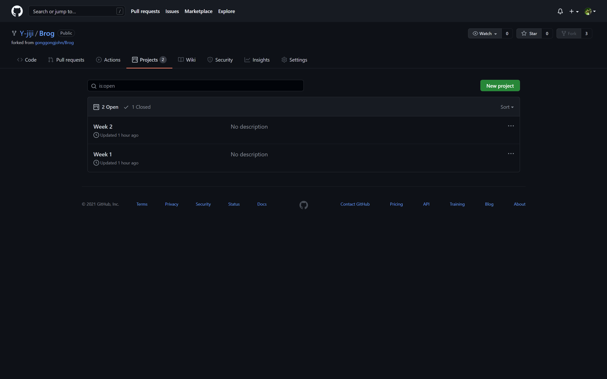
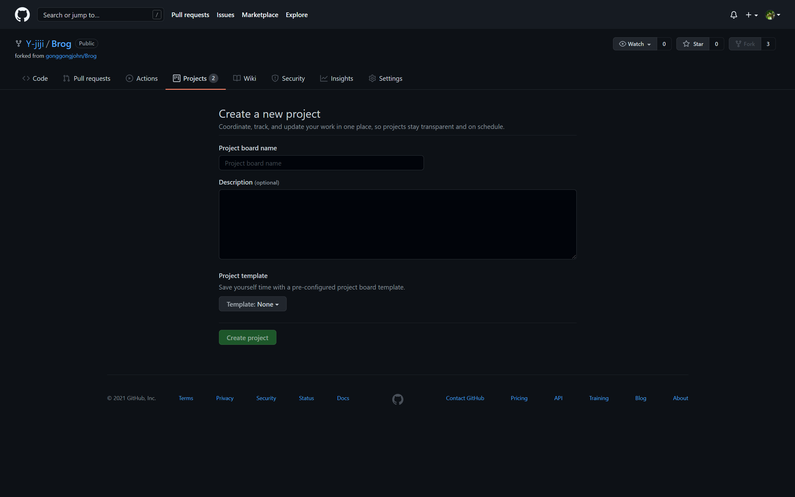
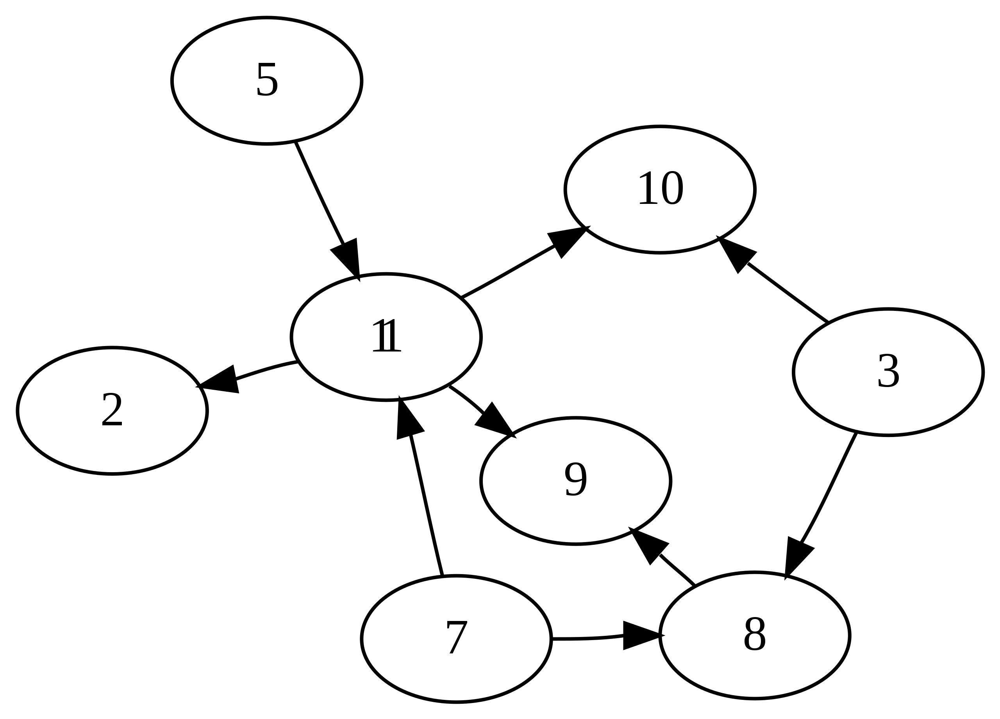
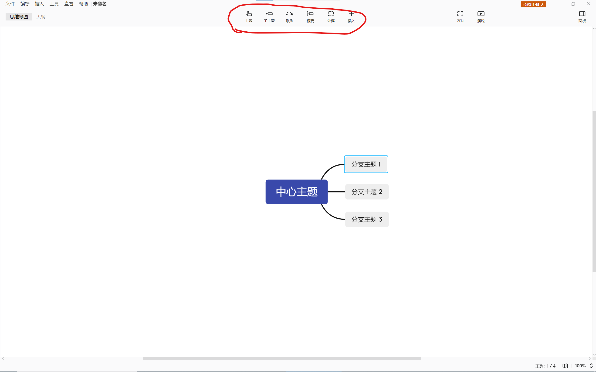
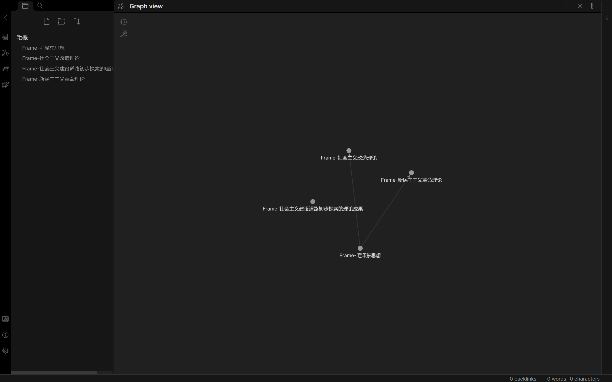
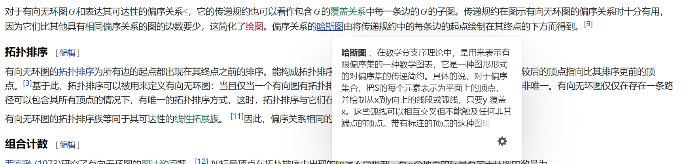

# 2021-10-27 组会纪要

## 讨论分成几个网页, 每个网页放啥

> 功能设想和业务划分

### 登录注册 Login & Register

没有特殊要求. 只要包含用户名/邮箱, 密码, 验证码. 

登录后跳转到个人主页. 

### 个人主页 Homepage

#### 进度管理 Progress Management (NaviBar的选项)

(进入个人主页后即展示进度管理)

(参考github上的projects功能, 详见参考资料\[1\])

- 初始界面展示所有progress

- 添加新的progress
  - progress的名称
  - progress的描述
  - 通过全站搜索添加progress的学习目标

- 每个progress点开后是一个有向无环图

  (有向无环图的定义详见参考资料\[2\]; 界面的设计与思维导图有微妙的差别, 想象中的效果详见参考资料[4\])

  - 对每个节点, 可以(类似Xmind中的编辑方式, 详见参考资料\[3\]): 
    - 通过全站搜索添加后继节点, 通过全站搜索添加前驱节点. 
    - 可以为它添加指向另一个节点的有向边(通过页内搜索或者直接连接的方式)
    - 可以为它添加从另一节点指向它的有向边(通过页内搜索或者直接连接的方式)
  - 对每条有向边, 可以删除它, 或者改变它的其中一端(通过页内搜索或者直接连接的方式)

- 可以将projectA合并到projectB, 可以选择将projectA当中的哪个节点连接到projectB当中的哪个节点. 

- 合并提醒功能: 检测到projectA可以合并到projectB(后续学习路径重合), 可以关闭这个提醒. 

#### 书签 Book Mark (NaviBar的选项)

- 书签对应的标注文字展示, 书封面的缩略图展示, 展示为一个卡片. 

- 包含一个搜索框, 搜索书签的注释. 

#### Profile&Settings(NaviBar的选项)

(参考github上的profile和personal settings)

- 用户邮箱, 对外展示的昵称, 从事的职业, 学习兴趣. 

- 用户界面的亮色/暗色. (目前只设计亮色, 暂时不需要暗色)

### 阅读器

顶栏或者某个侧边栏, 或者某种悬浮窗

- 显示当前处于哪个进度P当中的哪个节点N. 
- 显示系统为用户安排的下一个节点S. 
- 可以查看这个节点N的所有后继. (可折叠)
- 可以查看该进度中P所有可学习的节点, 用户可以将这个节点选作待学习的下一个知识点. (可折叠)

主界面: 

- 可以加下划线, 添加注释, 作为书签. 

- 可以看书本的目录(参考Edge浏览器的PDF阅读功能). 

- 分页阅读, 用户可以选择从上到下阅读, 还是左右翻页. 

侧边栏, 或悬浮窗(如果设计成悬浮窗, 可参考Wikipedia将鼠标放在链接上出现的页面, 详见参考资料\[5\]): 

- 主要功能: 提供对文中内容的搜索
  - 具有筛选功能, 筛选有三个维度
    - 筛选前驱还是后继
    - 搜索出来的内容和当前内容的具体关系, 筛选是否是例子
    - 筛选格式, 是否Markdown, LaTeX, 是否为PDF
  - 做成卡片浏览的形式
    - 可以将卡片添加为当前节点的前驱或后继
    - 这个Reference是PDF还是Markdown还是LaTeX
    - 点开后的浏览界面: 侧边栏展示或全屏
      - PDF仅支持全屏展示(技术上不能实现侧边栏展示)
      - Markdown或者LaTeX支持全屏或侧边栏展示. 
      - 可以添加为当前节点的前驱或后继

### 参考资料如下

[1] [github仓库下的Projects功能](https://github.com/Y-jiji/Brog/projects)

[2] [有向无环图的定义](https://zh.wikipedia.org/wiki/%E6%9C%89%E5%90%91%E6%97%A0%E7%8E%AF%E5%9B%BE#:~:text=%E5%8F%82%E8%80%83%E6%96%87%E7%8C%AE-,%E5%AE%9A%E4%B9%89,-%5B%E7%BC%96%E8%BE%91%5D)

[图](https://zh.wikipedia.org/wiki/图_(数学))由[顶点](https://zh.wikipedia.org/wiki/顶点_(图论))和连接这些顶点的[边](https://zh.wikipedia.org/wiki/边_(图论))所构成。每条边都带有从一个顶点指向另一个顶点的方向的图为[有向图](https://zh.wikipedia.org/wiki/有向图)。有向图中的[道路](https://zh.wikipedia.org/wiki/道路_(图论))为一系列的边，系列中每条边的终点都是下一条边的起点。如果一条路径的起点是这条路径的终点，那么这条路径就是一个环。有向无环图即为没有环出现的有向图。

[3] 思维导图软件XMind

希望能够在节点上右键就能实现上面的这些功能. 

[4] Obisidian

\[5\] wikipedia中的悬浮窗

## 讨论算法咋做(未完成)

> 技术路线

### 路径推荐

使用GRU和基于Encoder-Decoder架构的模型, 用处理Seq2Seq的思路来处理路径规划问题. 

### 文件上传处理

### 学习路径信息

